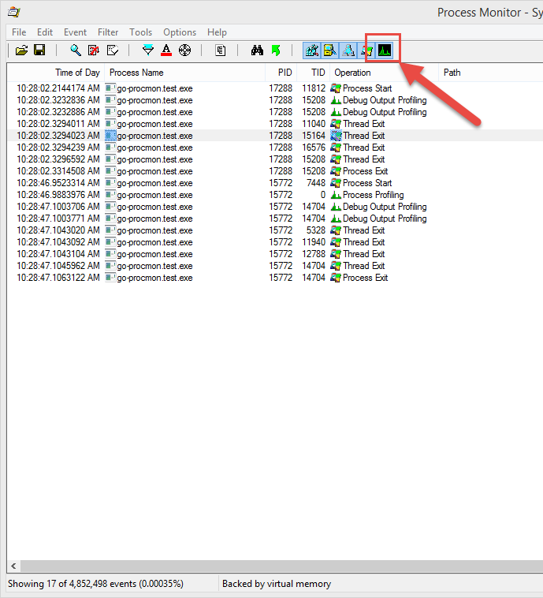
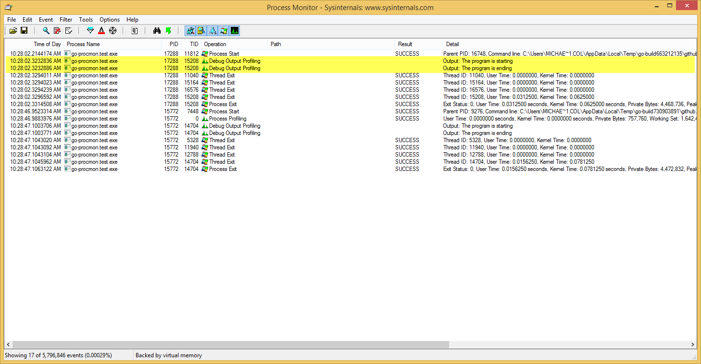

Process Monitor Debug Logger
============================
[](https://travis-ci.org/mfcollins3/go-procmon)
[](https://ci.appveyor.com/project/mfcollins3/go-procmon/branch/master)

This project implements support for Go programs to write debug messages
to [Process Monitor](https://technet.microsoft.com/en-us/Library/bb896645.aspx)'s
log when running on a Microsoft Windows computer or
virtual machine. Process Monitor is a helpful tool for monitoring
running programs and diagnosing problems with accessing resources at
runtime. This library makes Process Monitor logs more valuable by
outputting debug messages to Process Monitor providing context to the
operations that are captured and recorded in the log.

Get the Code
------------
Use the `go get` command to download the source code and build the
library in your Go workspace:

    $ go get github.com/mfcollins3/go-procmon

To use the Process Monitor library in your own programs or libraries,
add the following import statement to your source file:

```go
import procmon "github.com/mfcollins3/go-procmon"
```

Writing Debug Messages to Process Monitor
-----------------------------------------
The `go-procmon` library uses the `io.Writer` pattern for outputting
debug messages to Process Monitor. This makes it easy to send different
kinds of output to Process Monitor using libraries such as `fmt` to send
formatted strings containing error or performance information. Debug
messages sent to Process Monitor are converted into UTF-16-encoded
strings and cannot be longer than 2048 characters in length.

### Outputting Simple Strings

To output a simple static message to Process Monitor's log, you can
use `io.WriteString`:

```go
io.WriteString(procmon.ProcessMonitor, "The program is starting")
```

Calling `io.WriteString` is more efficient than using `io.Writer.Write`
because the implementation of `io.Writer.Write` has to convert the byte
array containing the debug message back to a string before writing the
message to Process Monitor.

### Outputting Formatted Strings

`fmt.Fprintf` makes it easy to output formatted debug messages to
Process Monitor. For example, the following code will output an error
message to the Process Monitor log:

```go
err = doSomething(...)
if nil != err {
  fmt.Fprintf(procmon.ProcessMonitor, "An error was reported: %v", err)
}
```

Unsupported Platforms or Process Monitor is not Installed
---------------------------------------------------------
Program developers do not need to determine whether or not Process
Monitor is installed or whether the program is running on Microsoft
Windows in order to use this library. By default, a null implementation
is provided. If the host operating system is not Microsoft Windows, the
null implementation will be used and nothing will be written out to a
log. Writing to `procmon.ProcessMonitor` will have no effect and will
minimally affect program performance.

On a Microsoft Windows host, if Process Monitor is not installed or if
there is an error opening the Process Monitor logging device, the null
implementation will also be used by default.

Troubleshooting Process Monitor Output
--------------------------------------
On Microsoft Windows, the package `init` function will attempt to open
the Process Monitor logging device. If an error occurs or the device is
not found, then the null implementation will be used. If Process
Monitor is installed and no output is being written to the Process
Monitor log, you can observe the initialization process using
[DebugView](https://technet.microsoft.com/en-us/Library/bb896647.aspx).
The `init` function will output debug messages to DebugView reporting
any errors that occurred during the initialization process.

Viewing Process Monitor Debug Messages
--------------------------------------
By default, Process Monitor does not show debug messages. Debug messages
are included in the Profiling Events category. To view the debug
messages, you need to enable profiling events by selecting the button on
the Process Monitor toolbar:



Once profiling events are enabled, your debug messages will appear in
the log under the category **Debug Output Profiling** and the message
text will be displayed in the **Results** field. If you do not see the
**Results** field in the log, it may be off the screen. You will need
to scroll over or resize the visible columns to see the message text.


